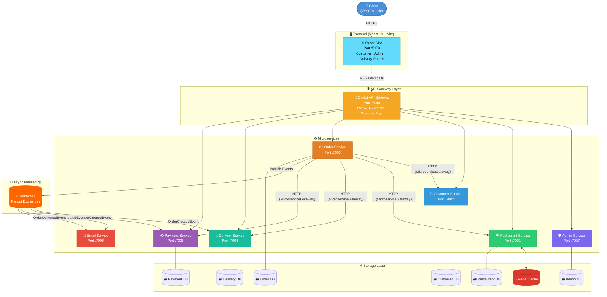
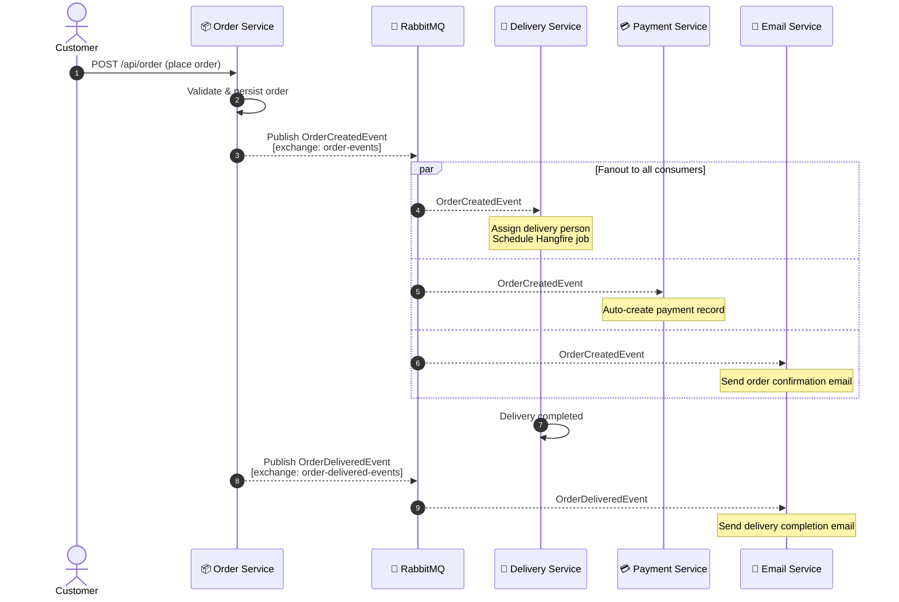
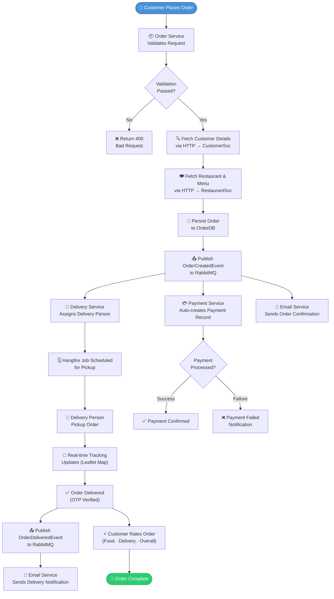
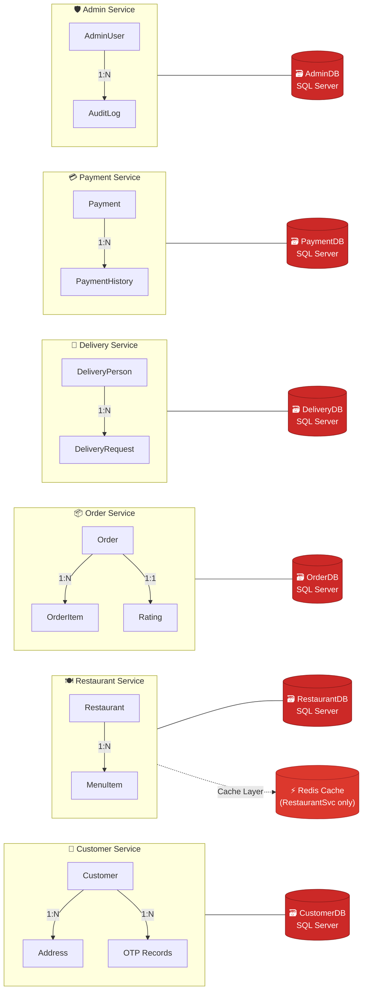
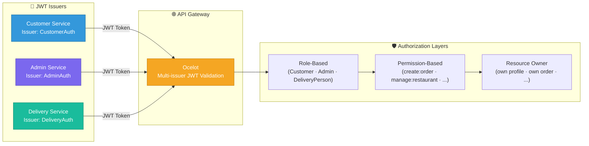

# 🍕 FoodDelivery Microservices

<div align="center">

[](https://dotnet.microsoft.com/)
[](https://docs.microsoft.com/en-us/dotnet/csharp/)
[](https://react.dev/)
[](https://vitejs.dev/)
[](https://www.rabbitmq.com/)
[](https://redis.io/)
[](https://www.microsoft.com/en-us/sql-server)
[](https://www.docker.com/)

**A production-ready, full-stack, event-driven Food Delivery platform built with .NET 8 Microservices + React 19.**

*Clean separation of concerns · Independent deployability · Fault-tolerant messaging · Role-based security · Live delivery tracking*

</div>

---

## 📋 Table of Contents

- [Architecture Overview](#-architecture-overview)
- [Technology Stack](#-technology-stack)
- [Microservices Details](#-microservices-details)
- [Frontend Application](#-frontend-application)
- [API Gateway Routing](#-api-gateway-routing)
- [Event-Driven Architecture](#-event-driven-architecture)
- [Order Lifecycle Workflow](#-order-lifecycle-workflow)
- [Database Architecture](#-database-architecture)
- [Project Structure](#-project-structure)
- [Prerequisites](#-prerequisites)
- [Getting Started](#-getting-started)
- [API Endpoints](#-api-endpoints)
- [Authentication & Authorization](#-authentication--authorization)
- [Contributing](#-contributing)
- [License](#-license)

---

## 🏗️ Architecture Overview

The platform follows a **microservices architecture** where each domain is an independently deployable service communicating through an API Gateway and an asynchronous message broker. A **React 19 SPA** serves as the unified frontend for customers, admins, and delivery personnel.



---

## 🛠️ Technology Stack

### Backend

| Category | Technology | Purpose |
|---|---|---|
|  | **.NET 8 / ASP.NET Core** | Core framework |
|  | **C# 12** | Primary language |
|  | **Ocelot + MMLib.SwaggerForOcelot** | API Gateway & Swagger aggregation |
|  | **RabbitMQ** | Async messaging (Fanout exchanges) |
|  | **SQL Server + EF Core** | Persistent storage (DB per service) |
|  | **Redis** | Distributed caching |
|  | **Hangfire** | Background & scheduled jobs |
|  | **JWT Bearer** | Multi-issuer authentication |
|  | **FluentValidation** | Input validation |
|  | **Serilog + Seq** | Structured logging |
|  | **Swagger / OpenAPI** | API documentation per service |

### Frontend

| Category | Technology | Purpose |
|---|---|---|
|  | **React 19** | UI framework |
|  | **Vite 6** | Build tool & dev server |
|  | **React Router v7** | Client-side routing |
|  | **Tailwind CSS v4** | Utility-first styling |
|  | **MUI v7** | Component library |
|  | **Framer Motion** | Animations & transitions |
|  | **Recharts** | Analytics charts |
|  | **React Leaflet** | Live delivery map tracking |
|  | **Axios** | HTTP client for API calls |

---

## 🧩 Microservices Details

| Service | Port | Description | Database |
|---|---|---|---|
| 🌐 **API Gateway** | `7000` | Ocelot routing, JWT auth, CORS, Swagger aggregation | — |
| 🛡️ **Admin Service** | `7007` | Admin authentication, system-wide management | `AdminDB` |
| 🍽️ **Restaurant Service** | `7001` | Restaurant & menu CRUD, Redis caching, analytics | `RestaurantDB` |
| 👤 **Customer Service** | `7002` | Registration, JWT auth, profiles, multi-address, OTP | `CustomerDB` |
| 📦 **Order Service** | `7003` | Order lifecycle, ratings, inter-service HTTP calls, event publishing | `OrderDB` |
| 🚚 **Delivery Service** | `7004` | Delivery persons, tracking, Hangfire jobs, event consumer | `DeliveryDB` |
| 💳 **Payment Service** | `7005` | Payment processing, history, auto-created from events | `PaymentDB` |
| 📧 **Email Service** | `7006` | Email notifications triggered by RabbitMQ events | — |
| 📚 **Common Messaging** | — | Shared library: RabbitMQ bus, event handlers, RBAC, OTP, Audit | — |

---

## 🖥️ Frontend Application

The **FoodDelivery Frontend** is a modern, full-featured React 19 Single Page Application (SPA) built with Vite 6. It provides three distinct portals — **Customer**, **Admin**, and **Delivery Person** — all within one unified application, protected by role-based routing.

### 🌟 Frontend Features

| Feature | Details |
|---|---|
| 🏠 **Home Page** | Hero section, restaurant discovery, featured items with animations |
| 🍽️ **Restaurant Browser** | Browse all restaurants, filter by category, view menus |
| 🛒 **Shopping Cart** | Persistent cart (CartContext), add/remove items, quantity management |
| 💳 **Checkout** | Address selection, order placement with payment integration |
| 📦 **Order Tracking** | Real-time order status, order history with ratings |
| 📍 **Live Map Tracking** | Leaflet map showing delivery person location in real time |
| 🔐 **Auth Flows** | Register, Login (customer / admin / delivery), OTP-based password reset |
| 🛡️ **Admin Dashboard** | Analytics charts (Recharts), manage restaurants, menus, users, delivery staff |
| 🚚 **Delivery Portal** | Delivery person dashboard, accept/complete deliveries, OTP verification |
| ❤️ **Favourites** | Save and manage favourite restaurants |
| 💡 **Dark / Light Theme** | System-aware theme with `ThemeProvider` (localStorage persisted) |
| 📱 **Responsive Design** | Fully responsive across mobile, tablet, and desktop |

### 🗂️ Frontend Page Routes

| Route | Page | Access |
|---|---|---|
| `/` | Home | Public |
| `/login` | Login | Public |
| `/register` | Register | Public |
| `/forgot-password` | Forgot Password | Public |
| `/verify-otp` | OTP Verification | Public |
| `/reset-password` | Reset Password | Public |
| `/restaurant/:id` | Restaurant Detail | Public |
| `/menu-items` | Browse Menu Items | Public |
| `/cart` | Shopping Cart | Public |
| `/checkout` | Checkout | Customer |
| `/orders` | My Orders | Customer |
| `/orders/:id` | Order Detail | Customer |
| `/payments` | Payment History | Customer |
| `/track-order` | Track Order | Public |
| `/profile` | Customer Profile | Customer |
| `/admin` | Admin Dashboard | Admin |
| `/admin/users` | Manage Users | Admin |
| `/admin/customers/:id` | Customer Detail (Admin) | Admin |
| `/admin/restaurants` | Manage Restaurants | Admin |
| `/admin/restaurants/:id/menus` | Manage Menus | Admin |
| `/admin/delivery-persons` | Manage Delivery Staff | Admin |
| `/delivery-dashboard` | Delivery Overview | Delivery / Admin |
| `/delivery-person-dashboard` | Delivery Person Hub | Delivery / Admin |
| `/deliveries` | Active Deliveries | Delivery / Admin |
| `/delivery-profile` | Delivery Person Profile | Delivery / Admin |
| `/live-track-delivery/:id` | Live Map Tracking | Delivery / Admin |
| `/delivery-otp-verify/:id` | OTP Delivery Verify | Delivery / Admin |
| `/verify-delivery/:orderId` | Customer Delivery Verify | Customer |

### 🔧 Frontend Architecture

```
FoodDelivery-Frontend/
├── src/
│   ├── App.jsx                        # Root router with 3 role-based layouts
│   ├── main.jsx                       # Entry point with all providers
│   ├── index.css                      # Global styles
│   ├── theme.js                       # MUI theme tokens
│   │
│   ├── context/
│   │   ├── AuthContext.jsx            # JWT auth state, login/logout/roles
│   │   └── CartContext.jsx            # Cart items, add/remove/clear
│   │
│   ├── layouts/
│   │   ├── CustomerLayout.jsx         # Header + Footer for customer pages
│   │   ├── AdminLayout.jsx            # Sidebar navigation for admin panel
│   │   └── DeliveryLayout.jsx         # Sidebar for delivery portal
│   │
│   ├── pages/                         # 29 page components
│   │   ├── Home.jsx                   # Landing / discovery page
│   │   ├── AdminDashboard.jsx         # Analytics + overview (Recharts)
│   │   ├── DeliveryPersonDashboard.jsx# Delivery stats + period filter
│   │   ├── LiveTrackDelivery.jsx      # Leaflet live map
│   │   ├── Checkout.jsx               # Order placement flow
│   │   └── ...
│   │
│   ├── components/                    # 23 reusable components
│   │   ├── Header.jsx                 # Responsive nav with cart badge
│   │   ├── AnalyticsCharts.jsx        # Recharts dashboard charts
│   │   ├── DeliveryMap.jsx            # Leaflet map component
│   │   ├── ToastContainer.jsx         # Notification system
│   │   ├── ProtectedRoute.jsx         # Role-based route guard
│   │   └── ...
│   │
│   ├── api/                           # Axios API layer (per service)
│   ├── services/                      # Business logic helpers
│   └── utils/                         # Shared utility functions
```

### 🚀 Running the Frontend

```bash
cd FoodDelivery-Frontend

# Install dependencies
npm install

# Start the development server (default: http://localhost:5173)
npm run dev

# Build for production
npm run build

# Preview production build
npm run preview
```

> 💡 **Tip:** The frontend proxies API calls to the Ocelot Gateway at `https://localhost:7000`. Ensure the gateway and required backend services are running first.

---

## 🔀 API Gateway Routing

All client requests are routed through the Ocelot gateway at **port 7000**. The gateway handles JWT validation before forwarding requests downstream.

| Upstream Path (Gateway) | Downstream Service | Port |
|---|---|---|
| `/api/admin/*` | Admin Service | `7007` |
| `/api/restaurant/*` | Restaurant Service | `7001` |
| `/api/menu/*` | Restaurant Service | `7001` |
| `/api/auth/*` | Customer Service | `7002` |
| `/api/customer/*` | Customer Service | `7002` |
| `/api/customeraddress/*` | Customer Service | `7002` |
| `/api/order/*` | Order Service | `7003` |
| `/api/delivery/*` | Delivery Service | `7004` |
| `/api/deliveryperson/*` | Delivery Service | `7004` |
| `/api/payment/*` | Payment Service | `7005` |

---

## 📨 Event-Driven Architecture

Services communicate asynchronously through **RabbitMQ Fanout exchanges**, ensuring loose coupling and high resilience.



### RabbitMQ Exchanges

| Exchange | Type | Published By | Consumed By |
|---|---|---|---|
| `order-events` | Fanout | Order Service | Delivery Service, Payment Service, Email Service |
| `order-delivered-events` | Fanout | Order Service | Email Service |

---

## 🔄 Order Lifecycle Workflow



> 🔐 **OTP Delivery Verification:** Upon arrival, the delivery person enters a one-time password (displayed to the customer via the `/verify-delivery/:orderId` page) to confirm handoff. This prevents fraudulent delivery completions.

---

## 🗄️ Database Architecture

Each service owns its own database, enforcing the **Database-per-Service** pattern for true isolation and independent scalability.



> **Key principle:** No service can directly query another service's database. Cross-service data access is achieved through HTTP calls (synchronous) or RabbitMQ events (asynchronous).

---

## 📁 Project Structure

```
food/                                      # Repository root
│
├── FoodDelivery-Frontend/                 # ⚛️ React 19 SPA (Vite 6)
│   ├── src/
│   │   ├── App.jsx                        # Root router (3 layouts)
│   │   ├── main.jsx                       # Entry point + all providers
│   │   ├── context/
│   │   │   ├── AuthContext.jsx            # JWT auth state & helpers
│   │   │   └── CartContext.jsx            # Shopping cart state
│   │   ├── layouts/
│   │   │   ├── CustomerLayout.jsx
│   │   │   ├── AdminLayout.jsx
│   │   │   └── DeliveryLayout.jsx
│   │   ├── pages/                         # 29 route-level pages
│   │   │   ├── Home.jsx
│   │   │   ├── AdminDashboard.jsx         # Charts + admin overview
│   │   │   ├── DeliveryPersonDashboard.jsx
│   │   │   ├── LiveTrackDelivery.jsx      # Leaflet live map
│   │   │   ├── Checkout.jsx
│   │   │   └── ...
│   │   ├── components/                    # 23 reusable components
│   │   │   ├── Header.jsx
│   │   │   ├── AnalyticsCharts.jsx        # Recharts charts
│   │   │   ├── DeliveryMap.jsx            # Leaflet map wrapper
│   │   │   ├── ProtectedRoute.jsx         # Role-based guard
│   │   │   └── ...
│   │   ├── api/                           # Axios service clients
│   │   ├── services/                      # Business logic helpers
│   │   └── utils/                         # Shared utilities
│   ├── package.json
│   └── vite.config.js
│
└── FoodDelivery-Microservices/            # 🔧 .NET 8 Backend Solution
    ├── FoodDelivery-Microservices.sln
    │
    ├── FoodDelivery.ApiGateway/           # Ocelot API Gateway (Port 7000)
    │   ├── ocelot.json                    # Ocelot route configuration
    │   └── Program.cs
    │
    ├── FoodDelivery.AdminService/         # Admin Service (Port 7007)
    │   ├── Controllers/
    │   ├── Models/
    │   └── Program.cs
    │
    ├── FoodDelivery.RestaurantService/    # Restaurant Service (Port 7001)
    │   ├── Controllers/
    │   ├── Models/
    │   ├── Services/                      # Redis caching logic
    │   └── Program.cs
    │
    ├── FoodDelivery.CustomerService/      # Customer Service (Port 7002)
    │   ├── Controllers/
    │   ├── Models/                        # Customer, Address, OTP
    │   ├── Services/                      # JWT, OTP, Password Reset
    │   └── Program.cs
    │
    ├── FoodDelivery.OrderService/         # Order Service (Port 7003)
    │   ├── Controllers/
    │   ├── Models/                        # Order, OrderItem, Rating
    │   ├── Infrastructure/
    │   │   └── MicroserviceGateway.cs     # HTTP inter-service client
    │   └── Program.cs
    │
    ├── FoodDelivery.DeliveryService/      # Delivery Service (Port 7004)
    │   ├── Controllers/
    │   ├── Models/                        # DeliveryPerson, DeliveryRequest
    │   ├── Jobs/                          # Hangfire background jobs
    │   ├── EventHandlers/                 # OrderCreatedEvent handler
    │   └── Program.cs
    │
    ├── FoodDelivery.PaymentService/       # Payment Service (Port 7005)
    │   ├── Controllers/
    │   ├── Models/
    │   ├── EventHandlers/                 # OrderCreatedEvent handler
    │   └── Program.cs
    │
    ├── FoodDelivery.EmailService/         # Email Service (Port 7006)
    │   ├── EventHandlers/                 # OrderCreated + OrderDelivered
    │   └── Program.cs
    │
    └── FoodDelivery.Common.Messaging/    # Shared Library
        ├── MessageBus/
        │   ├── IMessageBus.cs
        │   └── RabbitMQBus.cs             # RabbitMQ publish abstraction
        ├── Subscribers/
        │   └── GlobalMessageSubscriber.cs # Generic background event consumer
        ├── Interfaces/
        │   └── IIntegrationEventHandler.cs
        ├── Models/
        │   └── PagedResult.cs
        ├── Services/
        │   ├── IAuditService.cs / AuditService.cs
        │   └── IOtpService.cs / InMemoryOtpService.cs
        └── Authorization/
            ├── RoleRequirement.cs
            ├── PermissionRequirement.cs
            └── ResourceOwnerRequirement.cs
```

---

## ✅ Prerequisites

Ensure the following tools and services are installed and running before starting:

| Requirement | Version | Download |
|---|---|---|
| **.NET SDK** | 8.0+ | [dotnet.microsoft.com](https://dotnet.microsoft.com/download) |
| **Node.js** | 18.0+ | [nodejs.org](https://nodejs.org/) |
| **SQL Server** | 2019+ | [microsoft.com/sql-server](https://www.microsoft.com/en-us/sql-server/sql-server-downloads) |
| **RabbitMQ** | 3.12+ | [rabbitmq.com](https://www.rabbitmq.com/download.html) |
| **Redis** | 7.0+ | [redis.io](https://redis.io/download/) |
| **Seq** *(optional)* | Latest | [datalust.co/seq](https://datalust.co/seq) |
| **Git** | Latest | [git-scm.com](https://git-scm.com/) |

> 💡 **Tip:** RabbitMQ, Redis, and Seq can be quickly started with Docker:
> ```bash
> docker run -d --name rabbitmq -p 5672:5672 -p 15672:15672 rabbitmq:3-management
> docker run -d --name redis -p 6379:6379 redis:latest
> docker run -d --name seq -p 5341:5341 -p 80:80 datalust/seq:latest
> ```

---

## 🚀 Getting Started

### 1. Clone the Repository

```bash
git clone https://github.com/Shivam93294Valand/FoodDelivery-Microservices.git
cd FoodDelivery-Microservices
```

### 2. Configure Connection Strings (Backend)

Update `appsettings.json` in each service with your SQL Server, RabbitMQ, and Redis connection details:

```json
{
  "ConnectionStrings": {
    "DefaultConnection": "Server=localhost;Database=<ServiceDB>;Trusted_Connection=True;TrustServerCertificate=True"
  },
  "RabbitMQ": {
    "Host": "localhost",
    "Username": "guest",
    "Password": "guest"
  },
  "Redis": {
    "ConnectionString": "localhost:6379"
  }
}
```

### 3. Apply Database Migrations

Run EF Core migrations for each service that uses a database:

```bash
# From FoodDelivery-Microservices/ directory

cd FoodDelivery.CustomerService && dotnet ef database update && cd ..
cd FoodDelivery.RestaurantService && dotnet ef database update && cd ..
cd FoodDelivery.OrderService && dotnet ef database update && cd ..
cd FoodDelivery.DeliveryService && dotnet ef database update && cd ..
cd FoodDelivery.PaymentService && dotnet ef database update && cd ..
cd FoodDelivery.AdminService && dotnet ef database update && cd ..
```

### 4. Start All Backend Services

Open separate terminals (or use the Visual Studio / Rider multi-project launch) and run each service:

```bash
# Terminal 1 – API Gateway
dotnet run --project FoodDelivery.ApiGateway

# Terminal 2 – Admin Service
dotnet run --project FoodDelivery.AdminService

# Terminal 3 – Restaurant Service
dotnet run --project FoodDelivery.RestaurantService

# Terminal 4 – Customer Service
dotnet run --project FoodDelivery.CustomerService

# Terminal 5 – Order Service
dotnet run --project FoodDelivery.OrderService

# Terminal 6 – Delivery Service
dotnet run --project FoodDelivery.DeliveryService

# Terminal 7 – Payment Service
dotnet run --project FoodDelivery.PaymentService

# Terminal 8 – Email Service
dotnet run --project FoodDelivery.EmailService
```

### 5. Start the Frontend

```bash
cd FoodDelivery-Frontend
npm install
npm run dev
```

The app will be available at **http://localhost:5173**.

### 6. Verify All Endpoints

| Endpoint | Description |
|---|---|
| `http://localhost:5173` | React Frontend (Customer / Admin / Delivery) |
| `https://localhost:7000/swagger` | Aggregated Swagger UI (all services) |
| `https://localhost:7001/swagger` | Restaurant Service Swagger |
| `https://localhost:7002/swagger` | Customer Service Swagger |
| `https://localhost:7003/swagger` | Order Service Swagger |
| `https://localhost:7004/swagger` | Delivery Service Swagger |
| `https://localhost:7005/swagger` | Payment Service Swagger |
| `http://localhost:15672` | RabbitMQ Management UI (guest/guest) |

---

## 📡 API Endpoints

### 🛡️ Admin Service (`/api/admin`)

| Method | Endpoint | Description | Auth |
|---|---|---|---|
| `POST` | `/api/admin/login` | Admin login → JWT token | Public |
| `GET` | `/api/admin/dashboard` | System-wide dashboard stats | Admin |

### 🍽️ Restaurant Service (`/api/restaurant`, `/api/menu`)

| Method | Endpoint | Description | Auth |
|---|---|---|---|
| `GET` | `/api/restaurant` | List all restaurants | Public |
| `GET` | `/api/restaurant/{id}` | Get restaurant details | Public |
| `POST` | `/api/restaurant` | Create a restaurant | Admin |
| `PUT` | `/api/restaurant/{id}` | Update restaurant | Admin |
| `DELETE` | `/api/restaurant/{id}` | Delete restaurant | Admin |
| `GET` | `/api/restaurant/{id}/stats` | Restaurant analytics | Admin |
| `GET` | `/api/menu/{restaurantId}` | List menu items | Public |
| `POST` | `/api/menu` | Add menu item | Admin |
| `PUT` | `/api/menu/{id}` | Update menu item | Admin |
| `DELETE` | `/api/menu/{id}` | Delete menu item | Admin |

### 👤 Customer Service (`/api/auth`, `/api/customer`, `/api/customeraddress`)

| Method | Endpoint | Description | Auth |
|---|---|---|---|
| `POST` | `/api/auth/register` | Register new customer | Public |
| `POST` | `/api/auth/login` | Customer login → JWT token | Public |
| `POST` | `/api/auth/forgot-password` | Request password reset | Public |
| `POST` | `/api/auth/reset-password` | Reset password via OTP | Public |
| `GET` | `/api/customer/{id}` | Get customer profile | Customer |
| `PUT` | `/api/customer/{id}` | Update customer profile | Customer (Owner) |
| `GET` | `/api/customeraddress` | List addresses | Customer |
| `POST` | `/api/customeraddress` | Add new address | Customer |
| `PUT` | `/api/customeraddress/{id}` | Update address | Customer (Owner) |
| `DELETE` | `/api/customeraddress/{id}` | Delete address | Customer (Owner) |

### 📦 Order Service (`/api/order`)

| Method | Endpoint | Description | Auth |
|---|---|---|---|
| `POST` | `/api/order` | Place a new order | Customer |
| `GET` | `/api/order` | List orders (paginated) | Customer / Admin |
| `GET` | `/api/order/{id}` | Get order details | Customer (Owner) |
| `PUT` | `/api/order/{id}/status` | Update order status | Admin / Delivery |
| `POST` | `/api/order/{id}/rate` | Rate an order | Customer (Owner) |

### 🚚 Delivery Service (`/api/delivery`, `/api/deliveryperson`)

| Method | Endpoint | Description | Auth |
|---|---|---|---|
| `POST` | `/api/deliveryperson/register` | Register delivery person | Public |
| `POST` | `/api/deliveryperson/login` | Delivery person login → JWT | Public |
| `GET` | `/api/delivery` | List delivery requests | Delivery |
| `GET` | `/api/delivery/{id}` | Get delivery details | Delivery (Owner) |
| `PUT` | `/api/delivery/{id}/accept` | Accept delivery request | Delivery |
| `PUT` | `/api/delivery/{id}/complete` | Mark delivery complete | Delivery (Owner) |

### 💳 Payment Service (`/api/payment`)

| Method | Endpoint | Description | Auth |
|---|---|---|---|
| `GET` | `/api/payment/{orderId}` | Get payment for order | Customer / Admin |
| `GET` | `/api/payment/history` | Payment history | Customer / Admin |
| `PUT` | `/api/payment/{id}/status` | Update payment status | Admin |

---

## 🔐 Authentication & Authorization

### JWT Multi-Issuer Architecture

The platform uses **three separate JWT issuers**, each targeting a different user type:



### Authorization Policies

| Policy | Handler | Description |
|---|---|---|
| `RoleRequirement` | `RoleAuthorizationHandler` | Validates user roles from JWT claims |
| `PermissionRequirement` | `PermissionAuthorizationHandler` | Fine-grained permission checks |
| `ResourceOwnerRequirement` | `ResourceOwnerHandler` | Ensures users can only access their own resources |

### Token Structure

```json
{
  "sub": "customer-uuid",
  "email": "user@example.com",
  "role": "Customer",
  "permissions": ["create:order", "view:restaurant"],
  "iss": "CustomerAuth",
  "exp": 1700000000
}
```

### Frontend Route Guards

The React frontend implements role-based route protection via `ProtectedRoute.jsx`:

```jsx
// Admin-only route
<ProtectedRoute allowedRoles={['Admin']}>
  <AdminLayout />
</ProtectedRoute>

// Delivery person route
<ProtectedRoute allowedRoles={['DeliveryPerson', 'Admin']}>
  <DeliveryLayout />
</ProtectedRoute>

// Any authenticated user
<ProtectedRoute>
  <Checkout />
</ProtectedRoute>
```

Tokens are stored in `AuthContext` and attached to all Axios requests via an interceptor. Unauthenticated users are redirected to `/login`.

---

## 🤝 Contributing

Contributions are welcome! Please follow these steps:

1. **Fork** the repository
2. **Create** a feature branch:
   ```bash
   git checkout -b feature/your-feature-name
   ```
3. **Commit** your changes with a descriptive message:
   ```bash
   git commit -m "feat: add your feature description"
   ```
4. **Push** to your branch:
   ```bash
   git push origin feature/your-feature-name
   ```
5. **Open** a Pull Request against `main`

### Code Guidelines

#### Backend
- Follow existing coding conventions and project structure
- Add XML documentation to public APIs
- Ensure all new services register with the API Gateway (`ocelot.json`)
- Write integration-test-friendly code (dependency injection, no static state)
- Add FluentValidation validators for all new request models

#### Frontend
- Use functional components with hooks only
- Keep components focused and single-responsibility
- Use `AuthContext` for all auth state — no direct `localStorage` access
- Use `CartContext` for cart operations — never mutate state directly
- Follow the existing page / layout / component directory conventions
- Animations via Framer Motion — avoid CSS-only keyframes for interactive elements

---

## 📄 License

This project is licensed under the **MIT License** — see the [LICENSE](LICENSE) file for details.

---

<div align="center">

Built with ❤️ using **.NET 8 Microservices** + **React 19**

⭐ Star this repository if you find it helpful!

</div>
